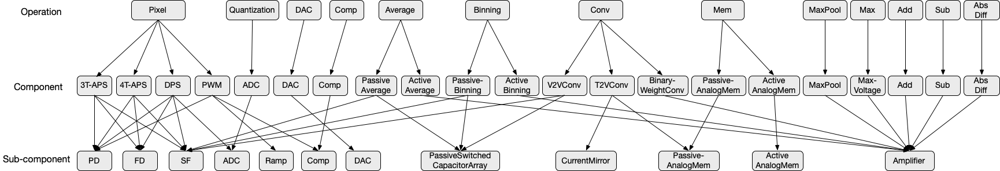
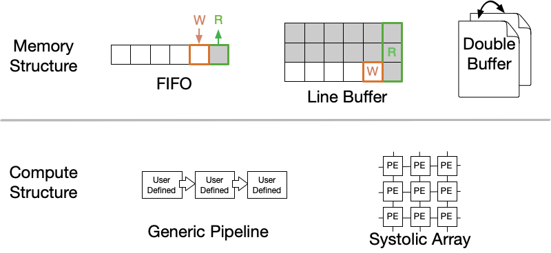

What Are Supported by CamJ?
==============================

**CamJ** provides a high-level interface that describes some commonly-used analog and digital
structures. Users can directly plug-in CamJ APIs in their image sensor designs. Here we summarize
these hareware structures.

Analog Domain
----------------------

The figure shown below presents all the analog components that are supported by **CamJ**.

In this figure, the top level shows the algorithmic operations that are currently supported in
**CamJ**. The second level shows the analog components that support the algorithmic operations 
at the top level. The bottom level shows the major basic analog components that compose the analog
components at the second level. Both the energy and noise modeling in **CamJ** are performed in
the analog components at the bottom level. The energy and noise modeling at the second level are
composed by the bottom level analog component.

CamJ Analog Interface
^^^^^^^^^^^^^^^^^^^^^^^^^^
To make **CamJ** easy to use, we expose the second-level as our standard interface. Expert users can
also extend our standard interface to implement more complex analog compoenent in their design. In
later Sections, we also introduce how to extend our standard interface.

The table below shows the overview of analog components at the second level:

.. raw:: html
    :file: analog_table.html

|

Analog Design Check Rules
^^^^^^^^^^^^^^^^^^^^^^^^^^
In ensure the correctness of user's implementation, **CamJ** provides a set of rules to check
the correctness of user's sensor designs in analog domain:

**Input/Output Size Compatibility** This rule enforces that an analog component has a 
sufficient number of producers to generate inputs if an analog component requires multiple input sources.

**Domain Compatibility** This rule enforces that each connected analog component pair has compatible
input and output interfaces. For instance, if the producer component's output signal is in voltage
domain, then, the input signal of the corresponding consumer component should be also in voltage
domain.

**Input Driver Compatibility** This rule ensures that the producer needs to have a driver if the 
corresponding consumer component requires a driver to drive the input signal.

How to Extend CamJ Interface
^^^^^^^^^^^^^^^^^^^^^^^^^^^^^

In addition to using Cam standard interface, users can also implement their own customized analog
component class. For each customized component class, users need to implement two main functions:

* ``energy(self)``: which calculates the energy consumption of this analog component when generating a given number of outputs. This given number of outputs should match ``num_output`` when assigning this customized analog component to an ``AnalogComponent`` instance.

* ``noise(self, input_signal_list: list)``: which defines how signals are processed in this analog component. The return of this function should be a tuple. The first element in this tuple is the name of this analog component in ``str``, the second element is the processed signals.

Digital Domain
----------------------

The interface in digital domain is much concise. Unlike analog domain, which has a handful of 
simulators or synthesis tools, designers can easily obtain per-cycle/access memory of their digital
structures via simulators or synthesis tools. Therefore, instead of providing low-level structure 
blocks, we provide rather high-level interface for users.  This is because of the design philosophy
of **CamJ**: it is not used to generate digital accelerators; rather, it helps assess how an
accelerator fits in the entire computational CIS system. For that reason, **CamJ** expects designers
to have a preliminary design of the digital accelerators (whether it’s your manual design, HLS 
generated, or a licensed IP), in which case one will have the per-cycle/access energy statistics.

The figure shown below presents the digital interface supported by **CamJ**. For more details, please
check out ``camj.digital`` package.

